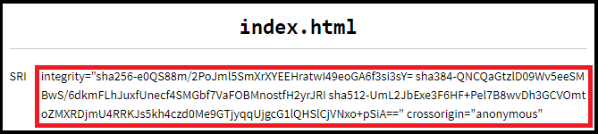

# Subresource Integrity Calculator
This tool will help generate the code needed to use subresource integrity for your offline files.

To use this tool, drag and drop your CSS and JavaScript files in the box with the dashed outline. The page will then generate the code for each of the files in a section below the box. The code will have the label “SRI” on the left and the code itself will be on the right, starting with the word “integrity”. Copy this code to your HTML where those files are referenced.

 
*This is the box where you drop your files.*

 
*This is what the output looks like. The portion outlined in red is what you copy to your HTML.*

## Support
The page has been designed to work with the latest versions of Chrome, Edge, Firefox, Opera, and Safari.

**Supported Browsers**
* Edge 15+
* Firefox 52+
* Google Chrome 55+
* Opera 42+
* Safari 10.1+

You can view the page at [https://myinon.github.io/sricalc/](https://myinon.github.io/sricalc/).
